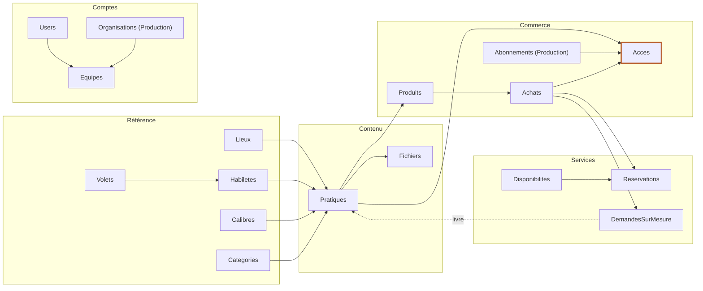

# Hub Entraîneurs — Cadrage produit et technique

Version 1 · 9 octobre 2026 · Techqueb

Statut : proposition issue de la discussion du 7 octobre 2026, à valider avec Steve. La section 2 liste ce qui est décidé ; le reste est proposé.

La partie A (sections 1 à 8) décrit le produit et s'adresse à tous. La partie B (sections 9 à 14) est technique.

# Partie A — Produit

## 1. En bref

- **Le problème :** un entraîneur de baseball trouve difficilement des pratiques adaptées à l'âge et au calibre de son équipe, et n'a pas accès facilement à un entraîneur certifié pour poser ses questions. Le catalogue public de Baseball Canada compte 31 plans de pratique, classés par des tags libres en anglais.
- **La solution :** un hub web où l'entraîneur trouve en trois clics une pratique pour son équipe, l'obtient gratuitement ou l'achète, réserve un appel Zoom avec un entraîneur certifié, ou commande une pratique sur mesure.
- **Le contenu existe déjà :** Steve a plus de 25 ans d'expérience et des centaines de pratiques prêtes, en PDF et en Word, dont il détient tous les droits.
- **Le modèle d'affaires :** l'entraîneur paie à l'unité ; l'association peut acheter l'accès pour ses entraîneurs. Paiement par Stripe.
- **Le premier lancement (MVP) :** catalogue, achat unitaire, réservation de Zoom, demande sur mesure. Environ 32 à 42 jours-personne de développement.
- **La cible prioritaire :** le parent bénévole qui dirige une équipe Récréatif ou B ; première association visée, Baseball Sherbrooke.

## 2. Décisions prises

| Sujet | Décision |
|---|---|
| Paiement | Stripe, dans l'application. Amilia n'est pas utilisé pour vendre le contenu du hub. |
| Qui paie | L'entraîneur et l'association, les deux. |
| Marchand | Un seul compte Stripe. Le Centre ou l'Académie : à brancher en configuration le moment venu, avec les taxes. |
| Rémunération des entraîneurs certifiés | Par l'Académie ou le Centre, hors de l'application. L'application fournit un relevé d'activité. |
| Contenu de départ | Les pratiques de Steve (des centaines, PDF et Word, prêtes). Steve en détient tous les droits. |
| Catégories couvertes | À partir du 9U. Le Rallye Cap (4 à 7 ans) est exclu : les entraîneurs y sont fournis. |
| Niveau | Le niveau est le calibre de l'équipe : Récréatif, B, A, AA, AAA. |
| Classement | Listes fermées gérées par l'administration. Aucun tag libre. |
| Règle d'annulation des Zoom | Reportée ; on n'en est pas là. |

## 3. Contexte

### 3.1 Ce qui existe ailleurs

Le catalogue de plans de pratique de Baseball Canada, consulté le 7 octobre 2026, montre ce qu'il faut éviter :

- **Tags libres sans gouvernance :** « 1st base » et « 1st base coach » coexistent, un tag vide regroupe 2 plans, « baseics » (avec une faute) en regroupe 10, et « baseball » sert de tag sur un site de baseball.
- **Information utile mal rangée :** les couleurs white, grey, black, green, blue et red désignent des niveaux de progression, mais rien ne l'explique au visiteur.
- **Un niveau qui ne filtre rien :** un même plan est classé débutant, intermédiaire et avancé.
- **Des compteurs incohérents :** « throwing (33) » sur 31 plans, signe que plans et exercices sont mélangés.
- **Aucun critère pratique :** ni âge, ni durée, ni lieu, ni nombre de joueurs.

### 3.2 Ce que prévoyait le document de départ

Le document de départ préparé avec Steve fixe le cadre :

- Le hub est accessible depuis les sites du Centre et de l'Académie, avec un lien depuis le site de Baseball Estrie.
- Il prend le relais des cours PNCE de Baseball Canada et de la sélection des entraîneurs par leur association.
- Partenaires : Baseball Estrie et le programme CTR. Première association visée : Baseball Sherbrooke.
- Il offre du soutien pour la pratique, l'avant-match et la gestion de match, par documents et par appels Zoom.
- Un texte explicatif clair, accessible à tous, présente le programme.

La section 5.2 indique où chaque élément de ce document se retrouve dans le plan.

## 4. À qui ça s'adresse

| Rôle | Qui | Ce qu'il fait dans le hub |
|---|---|---|
| Visiteur | Toute personne, sans compte | Lit la présentation, parcourt le catalogue, voit les fiches et leurs aperçus |
| Entraîneur | Coach d'une équipe, souvent parent bénévole | Crée son compte, décrit son équipe, obtient ou achète des pratiques, réserve un Zoom, commande une pratique sur mesure |
| Responsable d'association | Personne désignée par l'association (phase 2) | Achète des accès pour ses entraîneurs, les invite, suit l'utilisation |
| Entraîneur certifié | Steve et les autres experts de l'Académie | Publie ses disponibilités, donne les appels Zoom, réalise les pratiques sur mesure |
| Gestionnaire de contenu | Steve ou une personne de l'Académie | Publie et classe les pratiques, gère les listes de référence, suit les demandes |
| Administrateur | Sébastien et l'Académie | Gère les comptes, les prix et la configuration |

Une même personne peut cumuler : Steve sera probablement gestionnaire et entraîneur certifié.

## 5. Ce que le hub offre

### 5.1 Trois versions

| Version | Contenu | Ordre de grandeur |
|---|---|---|
| MVP | Inscription libre, profil et équipe (catégorie, calibre) · catalogue public filtrable et fiches avec aperçu · pratiques gratuites et achat unitaire par Stripe · « Mes pratiques » et téléchargement · réservation et achat d'un Zoom individuel · demande de pratique sur mesure à prix fixe · espace gestionnaire (pratiques, listes, demandes) · relevé par entraîneur certifié · page de présentation et lien vers les cours PNCE | 32 à 42 jours-personne |
| Production | Import en lot assisté par IA · licences d'association et invitations · abonnements (mois, trimestre, saison, année) et combos · Zoom de groupe et semi-privé, lien créé par l'API Zoom · filigrane au nom de l'acheteur · vidéos liées aux fiches · section règlements · affichage terrain sur cellulaire et version imprimable | 25 à 36 jours-personne |
| Futur | Banque d'exercices et assembleur de pratiques · plans de saison · forfaits incluant du temps de cage ou de terrain · suivi terrain · consultation hors ligne · FAQ alimentée par les questions reçues · ouverture à d'autres régions | Non estimé |

Les ordres de grandeur supposent un développeur senior qui travaille sur le socle existant. Ils sont à raffiner après la validation de ce document.

### 5.2 Ce que devient le document de départ

| Élément du document de départ | Où il se retrouve |
|---|---|
| Document unitaire | MVP : achat unitaire d'une pratique |
| Combos et trios de documents | Production : produit « combo » |
| Appel Zoom unitaire, privé | MVP : réservation d'un Zoom individuel |
| Zoom de groupe, semi-privé, série d'appels | Production |
| Choix d'un entraîneur | MVP : l'entraîneur choisit le créneau d'un entraîneur certifié |
| Choix du produit par discipline (général, lanceur, frappeur, avant-champ, champ, receveur) | Facette « Volet » du catalogue (section 6) |
| Services au mois, au trimestre, à la saison ou à l'année | Production : abonnements |
| Vidéos (Baseball Canada, maison, YouTube) | Production : lien vidéo sur la fiche |
| Texte explicatif clair | MVP : page de présentation publique |
| Bouton vers les cours PNCE | MVP |
| Liens depuis les sites du Centre, de l'Académie et de Baseball Estrie | MVP : simple lien, rien à développer |
| Côté réglementation | Production : section règlements |
| Suivi terrain, forfaits avec cage ou turf, « La Totale » | Futur. Les plateaux restent réservés et facturés dans Amilia. |
| Convention des entraîneurs | À préciser avec Steve |
| Facturation par Amilia | Remplacée par Stripe pour le hub |

## 6. Le catalogue

### 6.1 Les facettes

| Facette | Valeurs | Règle |
|---|---|---|
| Catégorie | 9U, 11U, 13U, 15U, 18U (liste à valider avec Steve) | Une plage min–max : une pratique 9U–11U sort dans les deux catégories |
| Calibre | Récréatif, B, A, AA, AAA | Une plage min–max, deux calibres au plus |
| Volet | Frappeur, lanceur, receveur, défensive (avant-champ, champ extérieur), course sur les buts, général | Un ou plusieurs |
| Habileté | Sous-liste de chaque volet, cinq à huit par volet (ex. lanceur : mécanique, retraits sur les buts, lancer long) | Facultative, liste tenue par Steve |
| Type | Pratique complète, exercice, avant-match, gestion de match | Un seul |
| Lieu | Terrain, gymnase, cage | Un ou plusieurs |
| Durée | En minutes | Obligatoire |
| Joueurs | Nombre minimal et maximal | Obligatoire |

### 6.2 Les règles du catalogue

- **Listes fermées.** Le gestionnaire choisit dans une liste ; il ne tape jamais un tag. Les listes sont gérées dans l'espace administration.
- **Plages ordonnées.** Catégories et calibres ont un ordre ; une plage couvre toutes les valeurs entre ses bornes. Si le Récréatif ne se place pas sous le B, l'ordre se corrige dans la liste.
- **Deux calibres au plus.** Sinon le filtre ne sert à rien, comme chez Baseball Canada. Une exception reste possible, justifiée par le gestionnaire.
- **Combinaisons valides.** Tous les calibres n'existent pas dans toutes les catégories ; une table catégorie × calibre évite d'offrir des filtres qui ne mènent nulle part.
- **Compteurs exacts.** Chaque valeur de filtre affiche son nombre de résultats ; les valeurs à zéro sont masquées.
- **Recherche texte en complément.** Elle porte sur le titre, le résumé et des mots-clés internes, invisibles au public.
- **L'équipe du coach comme filtre par défaut.** À l'inscription, l'entraîneur indique la catégorie et le calibre de son équipe ; l'accueil lui présente directement « Pour ton 11U A ».

### 6.3 La fiche d'une pratique

Une fiche affiche le titre, un résumé de deux ou trois lignes, les facettes, le matériel requis, un aperçu (première page) et, le cas échéant, une vidéo. Exemple de ligne de résultat :

> Relais et double jeu · 11U–13U · A–AA · Défensive (avant-champ) · Pratique complète · 75 min · Terrain · 12 joueurs

L'entraîneur sait en trois secondes si la pratique convient à son équipe, avant même de l'ouvrir.

### 6.4 Gratuit et payant

- Au moins une pratique gratuite par catégorie, concentrée sur le Récréatif et le B, là où se trouvent les parents bénévoles.
- Le visiteur voit la fiche et l'aperçu ; télécharger, même une pratique gratuite, demande un compte. Ça permet de connaître ses utilisateurs et de leur écrire.
- Le lancement se fait avec 40 à 60 pratiques choisies parmi les plus soignées, qui couvrent chaque catégorie. Le reste entre par vagues.

## 7. Parcours clés

### 7.1 Trouver et obtenir une pratique

1. L'entraîneur arrive sur l'accueil, filtré par défaut pour son équipe s'il est connecté.
2. Il affine par volet, habileté, durée ou lieu, puis ouvre une fiche.
3. Si la pratique est gratuite, il la télécharge. Sinon, il clique sur « Acheter » et paie sur la page Stripe.
4. Au retour, la pratique est dans « Mes pratiques » ; un reçu part par courriel.

### 7.2 Réserver un appel Zoom

1. L'entraîneur choisit un entraîneur certifié et un créneau parmi ceux publiés.
2. Il décrit sa question en quelques lignes, puis paie. Le créneau est bloqué pendant le paiement.
3. Le paiement confirmé, les deux parties reçoivent un courriel avec la date et le lien Zoom.
4. Après l'appel, l'entraîneur certifié marque la réservation « faite » ou « absent ». C'est ce statut qui alimente le relevé.

### 7.3 Demander une pratique sur mesure

1. L'entraîneur remplit un formulaire structuré : catégorie et calibre, volets, objectif, nombre de joueurs, durée, lieu, matériel, contraintes, date souhaitée.
2. Il paie un prix fixe.
3. Le gestionnaire assigne la demande à un entraîneur certifié, qui la réalise.
4. La pratique livrée apparaît dans « Mes pratiques » de l'entraîneur, visible de lui seul ; il est avisé par courriel.

### 7.4 Licence d'association (phase Production)

1. Le responsable achète un nombre de sièges pour la saison.
2. Il invite ses entraîneurs par courriel ou leur remet un code.
3. Chaque entraîneur qui accepte obtient l'accès, avec son équipe déjà configurée si l'association l'a saisie.
4. Un entraîneur retiré perd l'accès ; le siège se libère.

### 7.5 Publier des pratiques

1. MVP : le gestionnaire crée une fiche, téléverse le fichier, choisit les facettes, puis publie.
2. Production : il dépose un lot de fichiers ; l'outil propose titre, résumé et facettes pour chacun ; le gestionnaire valide ou corrige en une trentaine de secondes par pratique.

### 7.6 Relevé des entraîneurs certifiés

L'administrateur choisit une période et obtient, par entraîneur certifié, la liste des appels faits et des pratiques sur mesure livrées, exportable en CSV. Le relevé compte les actes ; le calcul de la rémunération se fait hors de l'application.

## 8. Paiement

- **Stripe Checkout hébergé.** La carte est saisie chez Stripe, jamais dans l'application.
- **Le webhook fait foi.** L'accès est accordé à la réception de l'événement de paiement confirmé, pas au retour du navigateur, qui peut ne jamais arriver.
- **Un seul compte, branché par configuration.** Clés Stripe, raison sociale et numéros de TPS et de TVQ sont des paramètres. Le choix entre le Centre et l'Académie doit être fait avant la première vente d'abonnement, parce qu'un abonnement actif ne se transfère pas simplement d'un compte Stripe à un autre.
- **Taxes.** TPS et TVQ calculées par ligne et conservées sur chaque achat. Taux en configuration, ou Stripe Tax si l'on préfère déléguer (à évaluer).
- **Prix au MVP.** Les prix vivent dans l'application et sont envoyés à Stripe au moment du paiement ; rien à synchroniser. Les abonnements de la phase Production demanderont des prix créés dans Stripe.
- **Remboursements au MVP.** Faits depuis le tableau de bord Stripe ; l'application reçoit l'événement et retire l'accès.
- **Amilia** reste l'outil des plateaux physiques (cage, terrain, turf).

# Partie B — Technique

## 9. Impact sur le socle actuel

Le socle (Node 22, Express, Sequelize, PostgreSQL, Angular 21, Firebase) reste la base. Ce qui change :

| Élément actuel | Changement proposé |
|---|---|
| Rôles `admin`, `manager`, `user` | Rôles `admin`, `gestionnaire`, `entraineur`, plus un indicateur `EstCertifie` sur `Users`. Un rôle unique par personne, l'indicateur permet à un gestionnaire d'être aussi entraîneur certifié. |
| Première connexion : rôle `user`, page « Compte en attente » | Rôle `entraineur` d'emblée ; la page d'attente disparaît. |
| Comptes créés par un administrateur | Inscription libre (Firebase, courriel et mot de passe, vérification du courriel). La création par un administrateur reste pour le personnel. |
| Toute l'application derrière `authGuard` | Trois zones : publique (présentation, catalogue, fiches), entraîneur (« Mes pratiques », réservations, demandes), gestion (le shell actuel). |
| Routes API protégées par défaut | Quelques routes publiques en lecture (`authRequired: false`) : catalogue, fiches, listes de référence ; plus le webhook Stripe. |
| `express.json()` appliqué à tout | Le webhook Stripe exige le corps brut pour vérifier la signature : monter `express.raw` sur sa route avant `express.json`. |
| CORS ouvert | Restreint à l'adresse du frontend avant la production. |
| Aucun stockage de fichiers | Bucket privé compatible S3 (DigitalOcean Spaces), téléchargement par URL signée de courte durée. |
| Service account Firebase du projet `centrebaseballpassionplus` | Confirmer si le hub partage ce projet Firebase ou en a un propre, comme le prévoyait le socle. |

Nouvelles variables, déclarées dans `src/config/default.js` et `.env.example` : `STRIPE_SECRET_KEY`, `STRIPE_WEBHOOK_SECRET`, `MARCHAND_NOM`, `MARCHAND_NO_TPS`, `MARCHAND_NO_TVQ`, `TAUX_TPS`, `TAUX_TVQ`, `S3_ENDPOINT`, `S3_BUCKET`, `S3_ACCESS_KEY`, `S3_SECRET_KEY`. En phase Production : identifiants de l'API Zoom et clé de l'API d'IA pour l'import.

Nouveaux composants backend, un dossier par fonctionnalité dans `src/components/` :

- **MVP :** `reference`, `pratique`, `fichier`, `equipe`, `produit`, `paiement`, `acces`, `disponibilite`, `reservation`, `demande`, `releve`.
- **Production :** `organisation`, `abonnement`, `import`.

## 10. Modèle de données

Conventions du socle : tables au pluriel, colonnes en PascalCase, clé `Id` entière, schéma par migrations seulement. Montants en cents (entiers). Dates en `TIMESTAMPTZ`, affichées à l'heure de Toronto. Les valeurs d'énumération sont en français, en minuscules.

Une flèche A → B signifie que B fait référence à A. `Users` est relié à presque toutes les tables ; ces liens sont omis pour la lisibilité. `Acces`, mis en évidence, est la table que le catalogue interroge pour décider de l'accès.

### 10.1 Référence

| Table | Colonnes principales | Notes |
|---|---|---|
| `Categories` | `Id`, `Code` (9U…), `Nom`, `Ordre`, `Actif` | `Ordre` porte la logique des plages |
| `Calibres` | `Id`, `Code`, `Nom`, `Ordre`, `Actif` | Récréatif, B, A, AA, AAA |
| `CategorieCalibres` | `CategorieId`, `CalibreId` | Combinaisons valides |
| `Volets` | `Id`, `Nom`, `Ordre`, `Actif` | |
| `Habiletes` | `Id`, `VoletId`, `Nom`, `Ordre`, `Actif` | |
| `Lieux` | `Id`, `Nom`, `Ordre` | Terrain, gymnase, cage |

### 10.2 Contenu

| Table | Colonnes principales | Notes |
|---|---|---|
| `Pratiques` | `Id`, `Titre`, `Resume`, `Type`, `Visibilite` (`catalogue`, `privee`), `Statut` (`brouillon`, `publiee`, `archivee`), `EstGratuite`, `CategorieMinId`, `CategorieMaxId`, `CalibreMinId`, `CalibreMaxId`, `DureeMinutes`, `JoueursMin`, `JoueursMax`, `Materiel`, `MotsCles`, `Source`, `VideoUrl`, `AuteurId`, `PublieeLe` | Une pratique sur mesure livrée est `privee` : jamais dans le catalogue |
| `PratiqueVolets` | `PratiqueId`, `VoletId` | Au moins un |
| `PratiqueHabiletes` | `PratiqueId`, `HabileteId` | L'habileté doit appartenir à un volet choisi |
| `PratiqueLieux` | `PratiqueId`, `LieuId` | |
| `Fichiers` | `Id`, `PratiqueId`, `Cle` (chemin dans le bucket), `NomOriginal`, `TypeMime`, `Taille`, `EstApercu` | L'aperçu est public, le fichier complet ne l'est jamais |

Requête de base d'un filtre par catégorie : la pratique sort si `CategorieMin.Ordre <= :ordre <= CategorieMax.Ordre`. Même logique pour le calibre.

### 10.3 Comptes et organisations

| Table | Colonnes principales | Notes |
|---|---|---|
| `Users` (existante) | ajout de `EstCertifie`, `ConsentementLe` | `Role` passe à `admin`, `gestionnaire` ou `entraineur` |
| `Equipes` | `Id`, `UserId`, `OrganisationId` (rempli en phase Production), `Nom`, `CategorieId`, `CalibreId`, `Saison` | Un entraîneur peut avoir plusieurs équipes ; la première sert de filtre par défaut |
| `Organisations` (Production) | `Id`, `Nom`, `CourrielContact`, `StripeCustomerId` | |
| `OrganisationMembres` (Production) | `Id`, `OrganisationId`, `UserId`, `Email`, `Role` (`responsable`, `membre`), `Statut` (`invite`, `actif`, `retire`), `InviteLe`, `AccepteLe` | `UserId` reste vide tant que l'invitation n'est pas acceptée |

### 10.4 Commerce

| Table | Colonnes principales | Notes |
|---|---|---|
| `Produits` | `Id`, `Type` (`pratique`, `zoom_individuel`, `sur_mesure` ; puis `combo`, `zoom_groupe`, `abonnement`, `licence`), `Nom`, `Description`, `PrixCents`, `PratiqueId`, `DureeMinutes`, `Periodicite`, `StripePriceId`, `Actif` | `StripePriceId` seulement pour les abonnements |
| `ProduitPratiques` (Production) | `ProduitId`, `PratiqueId` | Contenu d'un combo |
| `Achats` | `Id`, `UserId`, `OrganisationId`, `ProduitId`, `Quantite`, `MontantCents`, `TpsCents`, `TvqCents`, `Statut` (`en_attente`, `paye`, `rembourse`, `echoue`, `expire`), `StripeSessionId`, `StripePaymentIntentId`, `PayeLe` | Une ligne par session Stripe |
| `Abonnements` (Production) | `Id`, `UserId`, `OrganisationId`, `ProduitId`, `StripeSubscriptionId`, `Statut`, `PeriodeDebut`, `PeriodeFin`, `Sieges` | |
| `Acces` | `Id`, `UserId`, `Portee` (`pratique`, `catalogue`), `PratiqueId`, `Source` (`achat`, `abonnement`, `licence`, `sur_mesure`, `admin`), `AchatId`, `AbonnementId`, `OrganisationId`, `DebutLe`, `FinLe`, `RevoqueLe` | La seule table que le catalogue interroge pour décider |
| `StripeEvenements` | `Id` (identifiant Stripe de l'événement), `Type`, `RecuLe`, `TraiteLe` | Idempotence : un événement reçu deux fois n'est traité qu'une fois |

Règle d'accès, en une seule fonction de service :

- Administrateur et gestionnaire : tout.
- Pratique gratuite et publiée : tout compte connecté.
- Sinon : un `Acces` non révoqué, commencé et non échu, dont la portée est `catalogue` ou dont `PratiqueId` est la pratique.

Une licence d'association crée une ligne `Acces` par membre actif, et la révoque quand le membre est retiré. Achat, abonnement et licence aboutissent donc tous au même contrôle.

### 10.5 Zoom et pratiques sur mesure

| Table | Colonnes principales | Notes |
|---|---|---|
| `Disponibilites` | `Id`, `CertifieId` (`Users`), `DebutLe`, `FinLe`, `Format` (`individuel` ; puis `groupe`, `semi_prive`), `Capacite`, `ProduitId`, `LienZoom`, `Statut` (`ouverte`, `complete`, `annulee`) | Créneaux concrets, sans récurrence au MVP |
| `Reservations` | `Id`, `DisponibiliteId`, `UserId`, `AchatId`, `Statut` (`en_attente`, `reservee`, `faite`, `annulee`, `absent`), `Question`, `ExpireLe`, `NoteCertifie` | `en_attente` bloque la place pendant le paiement, jusqu'à `ExpireLe` |
| `DemandesSurMesure` | `Id`, `UserId`, `EquipeId`, `CategorieId`, `CalibreId`, `Objectif`, `JoueursNombre`, `DureeMinutes`, `LieuId`, `Materiel`, `Contraintes`, `DateSouhaitee`, `Statut` (`soumise`, `payee`, `en_cours`, `livree`, `fermee`), `CertifieId`, `AchatId`, `PratiqueLivreeId`, `LivreeLe` | |
| `DemandeVolets` | `DemandeId`, `VoletId` | |

Le relevé des entraîneurs certifiés est une requête sur `Reservations` (statut `faite`) et `DemandesSurMesure` (statut `livree`), regroupée par `CertifieId` et par période. Pas de table dédiée.

### 10.6 Import en lot (Production)

Pas de nouvelle table de contenu : l'import crée des `Pratiques` au statut `brouillon`, liées à un `ImportLots` (`Id`, `CreeParId`, `NbFichiers`, `Statut`, `CreeLe`) par une colonne `ImportLotId`. Chaîne de traitement :

1. Conversion des fichiers Word en PDF (LibreOffice sans interface, dans l'image Docker).
2. Extraction du texte ; reconnaissance de caractères pour les PDF numérisés.
3. Appel à un modèle de langage à qui l'on fournit les listes fermées ; il retourne un JSON validé contre ces listes.
4. Pré-remplissage du brouillon ; le gestionnaire valide dans une file « À valider ».

## 11. Jalons

| Jalon | Contenu | Estimation |
|---|---|---|
| J0 — Fondations | Rôles, inscription libre, zones publique, entraîneur et gestion, listes de référence, stockage des fichiers | 5 à 6 jours |
| J1 — Catalogue | Pratiques et facettes, gestion des fiches, catalogue public avec filtres et compteurs, fiche, équipe du coach | 8 à 10 jours |
| J2 — Paiement | Produits, Stripe Checkout, webhook et idempotence, `Achats`, `Acces`, « Mes pratiques », téléchargement sécurisé, reçus | 6 à 8 jours |
| J3 — Zoom | Disponibilités, réservation avec blocage, paiement, courriels, statuts, relevé | 6 à 8 jours |
| J4 — Sur mesure | Formulaire, suivi des statuts, assignation, livraison privée | 4 à 5 jours |
| J5 — Mise en ligne | Projet Firebase, CORS, `DB_SSL`, déploiement, pages de confidentialité, essais de bout en bout | 3 à 5 jours |
| **Total MVP** | | **32 à 42 jours** |

Phase Production, dans l'ordre proposé : import assisté par IA (5 à 7 jours), licences d'association (6 à 8), abonnements et combos (5 à 7), Zoom de groupe et API Zoom (4 à 6), filigrane (2 à 3), vidéos, règlements et affichage terrain (3 à 5). Total : 25 à 36 jours.

L'import assisté vient en tête de la phase Production : pour les 40 à 60 pratiques du lancement, la saisie manuelle suffit. Si Steve veut tout son catalogue au lancement, l'import passe dans le MVP.

## 12. Risques et points d'attention

| Risque | Conséquence | Parade |
|---|---|---|
| Pratiques classées trop large | Les filtres ne filtrent plus, comme chez Baseball Canada | Deux calibres au plus ; rapport de répartition par facette dans l'espace gestion |
| Saisie des métadonnées trop lourde pour Steve | Catalogue lent à remplir ou mal classé | Lancement à 40–60 pratiques ; import assisté par IA ensuite |
| Partage des PDF hors du hub | Ventes perdues | Filigrane au nom de l'acheteur ; licences d'association ; accepter une part de fuite |
| Documents hétérogènes sur 25 ans | Impression d'ensemble inégale | Choisir les plus soignés pour le lancement ; page couverture uniforme générée par le hub |
| Disponibilité des entraîneurs certifiés | Créneaux vides, clients déçus | Créneaux publiés par les certifiés eux-mêmes ; aucune promesse de délai |
| Double réservation d'un créneau | Deux clients pour une place | Transaction avec verrou sur la disponibilité ; réservation `en_attente` qui expire avec la session Stripe |
| Webhook manqué ou reçu deux fois | Accès non accordé, ou accordé deux fois | Table `StripeEvenements` ; Stripe relance les envois en échec ; vérification manuelle possible depuis l'espace gestion |
| Changement de marchand après des abonnements | Abonnements à recréer | Trancher Centre ou Académie avant la première vente d'abonnement |
| Métadonnées proposées par l'IA erronées, PDF numérisés | Mauvais classement | Validation humaine obligatoire ; listes fermées imposées au modèle ; reconnaissance de caractères |
| Loi 25 (renseignements personnels, Québec) | Non-conformité | Politique de confidentialité, consentement à l'inscription, responsable désigné, collecte minimale. À valider avec la personne responsable à l'Académie. |
| Sécurité du socle avant la production | Exposition | CORS restreint, `DB_SSL=true`, clés hors du dépôt, projet Firebase confirmé |

## 13. Questions ouvertes

| Question | Quand la trancher | Qui |
|---|---|---|
| Marchand : le Centre ou l'Académie | Avant la première vente d'abonnement | Académie et Centre |
| Grille de prix (pratique, Zoom, sur mesure, puis abonnement et licence) | Avant J2 | Steve et Sébastien |
| Liste exacte des catégories, combinaisons catégorie × calibre, habiletés par volet | Avant J1 | Steve |
| Pratiques gratuites et les 40 à 60 pratiques du lancement | Avant le lancement | Steve |
| Durée et formats des appels Zoom | Avant J3 | Steve |
| Règle d'annulation et de remboursement des Zoom | Reportée | Steve et Sébastien |
| Place de la convention des entraîneurs dans le hub | Phase Production | Steve |
| Projet Firebase propre au hub ou partagé | Avant J0 | Sébastien |
| Nom et identité visuelle du hub | Avant J5 | Académie |

## 14. Prochaines étapes

1. Steve relit les sections 2, 5 et 6 et corrige ce qui ne colle pas au terrain.
2. Steve fournit les listes de référence (catégories, habiletés par volet) et 5 à 10 pratiques de formats et d'époques variés, pour caler les fiches et, plus tard, l'import.
3. Sébastien démarre J0 sur le socle existant.
